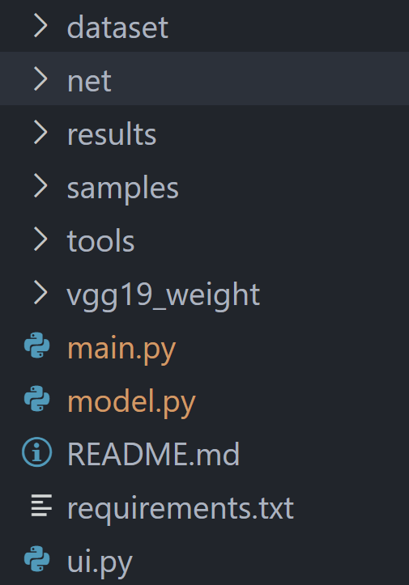

To download the rest of the files here is the link to the google drive folder: <https://drive.google.com/drive/folders/1DDfmBh8Ow1m1fnU35E1TJyXRSk4EL_Ev?usp=sharing>

# The file structure is as follows:

# INSTRUCTIONS:
1. Download the files from the google drive link above.
2. Unzip the files into a folder of your choice.
3. Open the folder in your terminal or command prompt.
4. Create a virtual environment using the command `python -m venv env`.
5. Activate the virtual environment using the command `source env/bin/activate` (Linux/Mac) or `env\Scripts\activate` (Windows).
6. Install the required packages using the command `pip install -r requirements.txt`.
7. Run the main script using the command `python .\main.py --phase test`.
8. The test results will be saved in the `results` folder.
9. To run the UI version, run the command `python .\ui.py`.